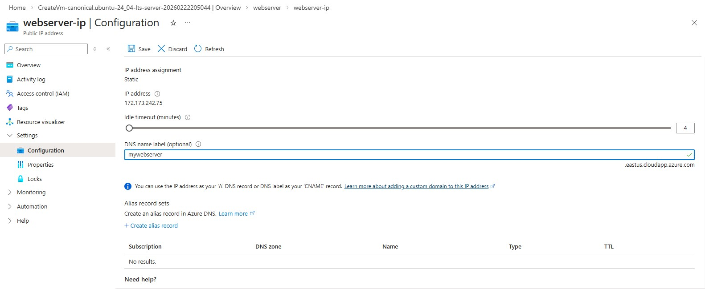
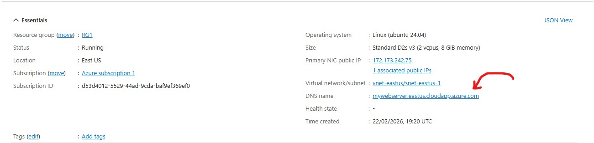
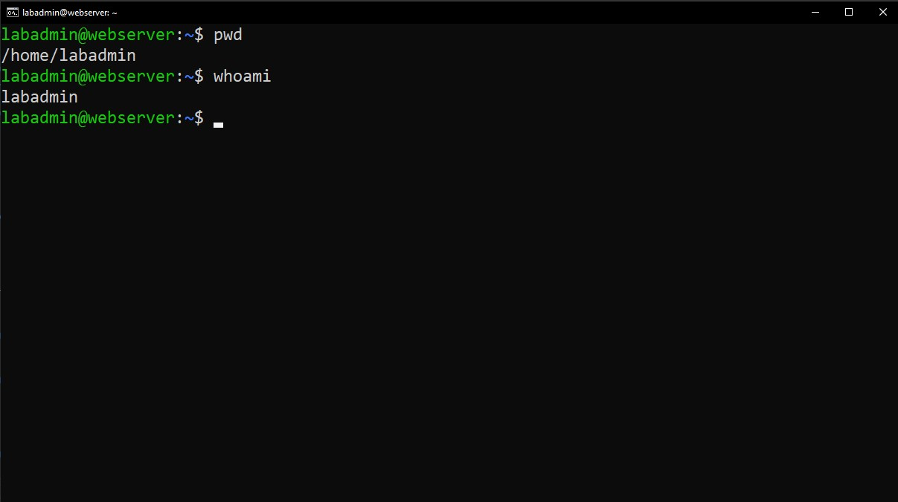
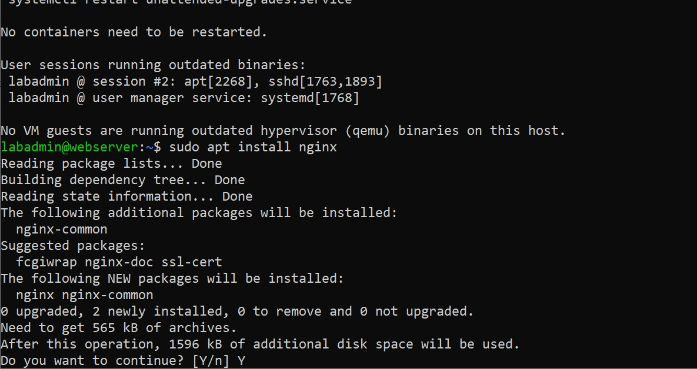
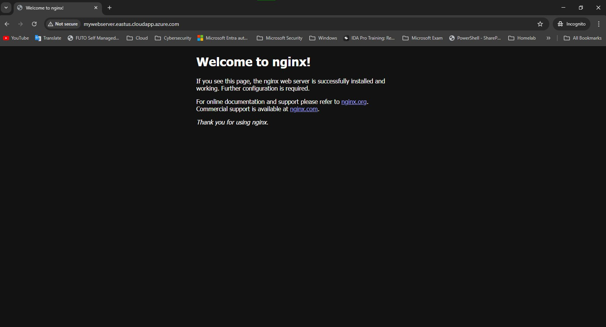
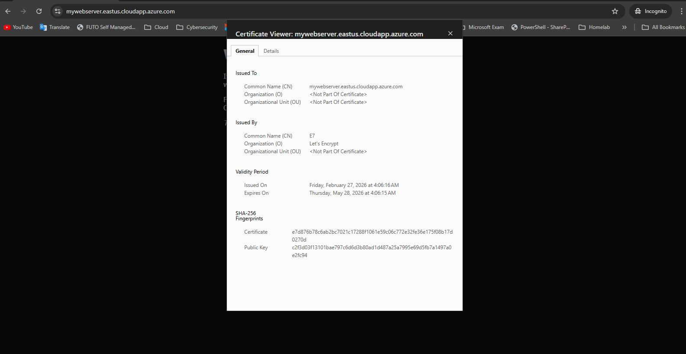

# Azure Linux VM – Nginx with HTTPS (Let's Encrypt)

## 📌 Project Overview

This lab demonstrates how to deploy a Linux Virtual Machine in Microsoft Azure, install Nginx, configure DNS using Azure's default public domain, and secure the web server with a free SSL certificate from Let's Encrypt.

The goal of this project was to simulate a real-world cloud administrator task: provisioning infrastructure, configuring a web server, and implementing HTTPS securely.


## 🏗 Architecture

- Microsoft Azure Virtual Machine (Ubuntu Linux)
- Public IP with Azure DNS label:
  - nginx-web.eastus.cloudapp.azure.com
- Network Security Group (NSG)
  - Port 80 (HTTP)
  - Port 443 (HTTPS)
- Nginx Web Server
- Let's Encrypt SSL Certificate via Certbot


## 🚀 Deployment Steps

###  Create Azure VM

- OS: Ubuntu Server 24.04 LTS
- Size: Standard_D2s_v3 (lab environment)
- Disk: 30GB, Premium SSD (locally-redundant storage)
- VNET and IP Address: Default
- Public IP: Yes (left to Default values)
- Open inbound ports:
  - 22 (SSH)
  - 80 (HTTP)
  - 443 (HTTPS)
    
<p align="left">
  
</p>

<br>

#### Assign a public DNS name:
Click on the public IP > **Configuration.**
I labelled mine: **mywebserver.eastus.cloudapp.azure.com**
<p align="left">
  
</p>
<p align="left">
  
</p>

###  Login 
<p align="left">
  
</p>

#### Update Packages
```bash
    sudo apt update
```

#### Install Nginx
```bash
    sudo apt install nginx
```
<p align="left">
  
</p>


#### Verify Nginx is serving your domain
```bash
    sudo nginx -t
    sudo systemctl status nginx
```

##### From your browser:
    mywebserver.eastus.cloudapp.azure.com
<p align="left">
  
</p>

#### Install Certbot
```bash
    sudo snap install --classic certbot
```

#### Enable certbot command
```bash
    sudo ln -s /snap/bin/certbot /usr/bin/certbot
```
<br>

### Get HTTPS certificate (Nginx plugin – easiest)
```bash
    sudo certbot --nginx
```

You’ll be asked:
1. **Email address** → enter a real one
2. Agree to terms → Y
3. Choose domain →
   Select:
     mywebserver.eastus.cloudapp.azure.com <your-domain>

4. Redirect HTTP to HTTPS → choose **Redirect**
Certbot will:
  * Get the certificate
  * Modify your Nginx config
  * Reload Nginx automatically
---

### Test HTTPS
Open browser:
  https://nginx-web.eastus.cloudapp.azure.com

You should see:
🔒 Secure lock
Valid Let’s Encrypt certificate

<p align="left">
  
</p>
<hr>

### 📚 Key Skills Demonstrated
* Azure VM deployment
* Azure Public IP & DNS configuration
* Network Security Group configuration
* Linux system administration
* Nginx configuration
* SSL/TLS implementation
* Certificate lifecycle management


### 🎯 Lessons Learned
* Port 80 must remain open for Let's Encrypt validation.
* DNS must resolve publicly before certificate issuance.
* Certbot can automatically modify Nginx configuration.
* Azure NSG misconfiguration can block SSL validation.
